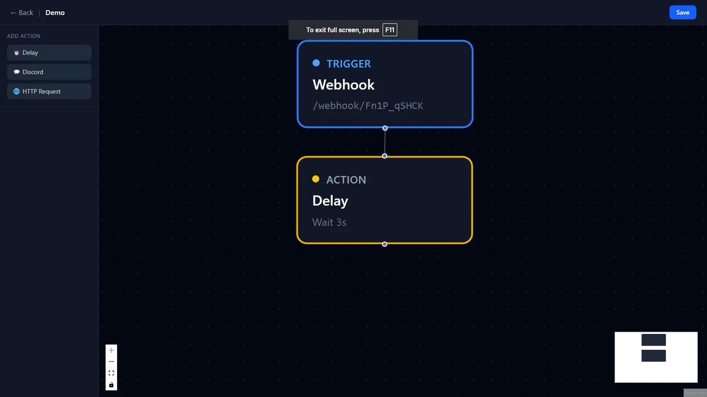
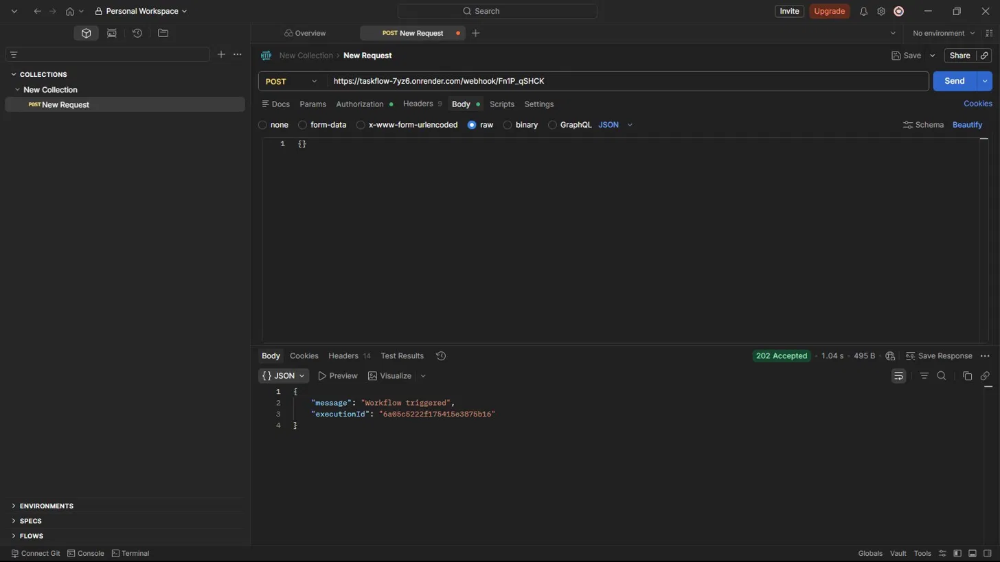
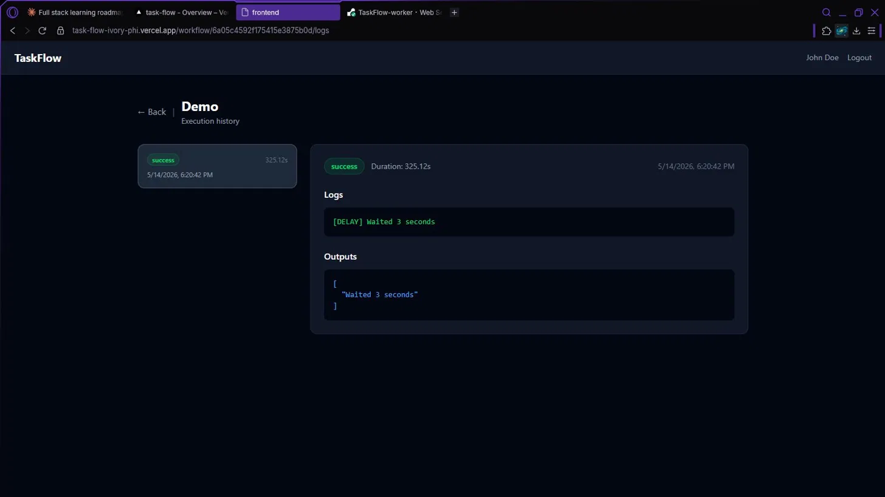

# TaskFlow

A workflow automation platform — think a simplified Zapier. You create workflows with a visual builder, attach a webhook trigger, and when that webhook gets hit, a queue-based worker picks it up and executes your actions sequentially.

Built this as a portfolio project to get proper hands-on experience with async worker systems, queue-based architecture, and event-driven backends — stuff that doesn't show up in typical CRUD projects.

**Live demo:** https://task-flow-ivory-phi.vercel.app


---

## What it does

- Build automation workflows using a drag-and-drop node editor
- Each workflow gets a unique webhook URL
- POST to that URL → job gets pushed to a Redis queue → worker picks it up and runs your actions
- Supported actions: HTTP requests, Discord messages, and delays
- Every execution is logged with status, timestamps, and outputs

---

## Demo

**1. Build a workflow using the visual node editor**


**2. Fire the webhook from anything — Postman, curl, another service**


**3. Execution logs update with status, duration and action outputs**


---

## Architecture

The system is split into three separate processes intentionally:

```
React Client
     ↓
Express API  →  Redis (BullMQ Queue)
                      ↓
               Worker Process  →  MongoDB (execution logs)
```

The API and worker are completely decoupled. The API just validates the webhook request, creates an execution record, and drops a job into the queue. The worker handles everything else — it doesn't care where the job came from. This means you could scale workers independently, add retry logic, or swap out the queue entirely without touching the API.

The backend is also split into `app.ts` (middleware, routes) and `server.ts` (DB connection, listen) so the app can be imported cleanly in tests without starting the server.

---

## Tech Stack

**Frontend**
- React + TypeScript (Vite)
- TailwindCSS
- React Flow — for the node-based workflow builder
- Zustand — lightweight state management for the builder canvas
- Axios

**Backend**
- Node.js + Express + TypeScript
- MongoDB + Mongoose
- JWT authentication
- BullMQ + Redis — queue system

**Worker**
- Separate Node.js process
- Consumes BullMQ jobs
- Executes actions sequentially, writes results back to MongoDB

**Infrastructure**
- Frontend → Vercel
- Backend + Worker → Render
- Database → MongoDB Atlas
- Queue → Upstash Redis

---

## Testing & CI

Integration tests cover the webhook trigger flow — seeding a mock workflow into a test database and asserting correct status codes for both valid and non-existent webhooks.

CI runs on every push to `Backend/**` via GitHub Actions, spinning up real MongoDB and Redis service containers. Can also be triggered manually from the Actions tab.

---

## Running locally

You'll need MongoDB and Redis running locally first.

**Backend**
```bash
cd Backend
npm install
# create .env with MONGO_URI, REDIS_URL, JWT_SECRET, PORT, CLIENT_URL
npx ts-node src/server.ts
```

**Worker**
```bash
cd Worker
npm install
# create .env with MONGO_URI, REDIS_URL
npx ts-node src/worker.ts
```

**Frontend**
```bash
cd Frontend
npm install
# create .env with VITE_API_URL=http://localhost:5000/api
npm run dev
```

---

## How a workflow execution works

1. User builds a workflow in the UI and saves it
2. Backend generates a unique webhook path (e.g. `/webhook/abc123`)
3. External service (or Postman) sends a POST to that path
4. Backend creates an `Execution` record with status `running`, pushes a job to BullMQ
5. Worker picks up the job, runs each action in order, updates the execution record with logs/outputs/status
6. User can view the execution history on the logs page

---

## Project structure

```
TaskFlow/
├── Frontend/      # React app
├── Backend/       # Express API
└── Worker/        # BullMQ worker process
```

Each folder is independently deployable which is the whole point of the separation.

---

## What I'd add with more time

- Retry logic for failed actions
- Scheduling trigger (run workflow on a cron schedule)
- More action types (Slack, email, etc.)
- Real-time execution updates via WebSockets instead of manual refresh
- Better error messages per action instead of a single failure status